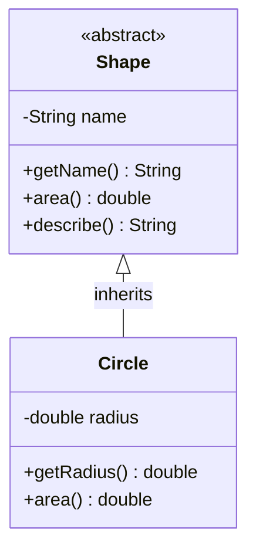
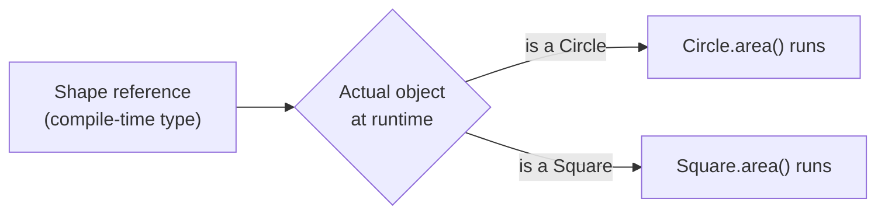

# Object-Oriented Programming Basics

> **Object-oriented programming (OOP)** is a paradigm that models software as a set of **objects** — bundles of data and the behavior that acts on that data — built from **classes** and organized around abstraction, encapsulation, inheritance, and polymorphism.

## Why it matters

OOP underpins most mainstream production languages (Java, C#, Python, C++, Kotlin), so interviewers use it to check whether you can reason about design, not just syntax. Questions in this area probe whether you understand *why* a language feature exists (e.g., why hide data, why prefer composition over inheritance) rather than just how to write the keyword. It also sets up follow-on discussions about SOLID principles, design patterns, and API design, so a shaky foundation here tends to cascade into weaker answers everywhere else.

## Class vs Object

A **class** is a blueprint: it declares what fields (state) and methods (behavior) instances will have, but it doesn't hold any real data itself. An **object** (or instance) is a concrete piece of memory created from that blueprint at runtime, with its own values for the fields the class defines.

| Aspect | Class | Object |
|---|---|---|
| What it is | A template/definition | A runtime instance of that template |
| Exists in memory? | Only as loaded metadata (e.g., in the method area/metaspace) | Yes, on the heap (in most languages) |
| Contains | Field declarations, method definitions | Actual field values |
| How many? | One definition per type | Zero, one, or many instances |
| Analogy | Architectural blueprint | The house built from it |

```java
class Car {                 // class: the blueprint
    private String model;
    private int speed;

    public void accelerate() { speed += 10; }
}

Car myCar = new Car();      // object: an instance with real state
Car yourCar = new Car();    // a second, independent instance
```

## The Four Pillars

OOP is usually taught as four pillars. Each is a distinct idea, but they reinforce each other: abstraction defines *what* matters, encapsulation *protects* it, inheritance *reuses* it, and polymorphism lets code *treat different things uniformly*.

| Pillar | Core idea | Typical language mechanism |
|---|---|---|
| Abstraction | Expose only relevant details, hide complexity | Abstract classes, interfaces |
| Encapsulation | Bundle data with behavior and control access to it | Access modifiers (`private`/`public`), getters/setters |
| Inheritance | Derive a new class from an existing one to reuse/extend behavior | `extends` / `: Base` / subclassing |
| Polymorphism | One interface, many implementations, resolved by the object's actual type | Method overriding, method overloading, interfaces |

- **Abstraction** answers "what should the caller know about?" — it's a modeling decision that simplifies a complex system down to the essential contract.
- **Encapsulation** answers "who can touch this data?" — it protects invariants by hiding internal representation behind a controlled interface.
- **Inheritance** answers "can I reuse and specialize existing behavior?" — it establishes an is-a relationship between a base type and a more specific type.
- **Polymorphism** answers "how do different objects respond to the same message?" — it lets calling code depend on a common type while the concrete behavior varies per instance.

Each pillar has its own dedicated file with deeper examples and trade-offs — see Related below.

## How the Pillars Fit Together

The diagram below shows a small class hierarchy that touches all four pillars: `Shape` is an abstraction (it declares a contract), its fields are encapsulated (private, accessed via methods), `Circle` inherits from it, and calling `area()` on either type resolves polymorphically to the correct implementation.



At runtime, calling `describe()` on a `Shape` reference that actually points to a `Circle` object dispatches to `Circle`'s logic — that dynamic dispatch is polymorphism in action, built on top of the inheritance relationship shown above.



## Why Use OOP

- **Modularity** — each class is a self-contained unit, so teams can work on different objects independently.
- **Reusability** — inheritance and composition let you build new behavior on top of existing, tested classes instead of rewriting it.
- **Maintainability** — encapsulation limits the blast radius of a change: internal representation can change without breaking callers, as long as the public contract stays stable.
- **Extensibility** — polymorphism lets you add new types (new subclasses or interface implementations) without modifying the code that already consumes the abstraction, which is the essence of the open/closed principle.
- **Closer mapping to real-world domains** — objects like `Order`, `Customer`, or `Invoice` map naturally onto business concepts, which makes the code easier to discuss with non-engineers and easier to onboard new engineers into.

OOP isn't free, though: it can add indirection, and overusing inheritance in particular tends to create rigid hierarchies. That's why "favor composition over inheritance" is a common piece of senior-level advice — it's worth knowing OOP's trade-offs, not just its benefits.

## Common Interview Questions

**Q: What are the four pillars of OOP?**
A: Abstraction, encapsulation, inheritance, and polymorphism. Abstraction hides unnecessary detail behind a simple contract, encapsulation protects an object's internal state, inheritance lets a class reuse and extend another class's behavior, and polymorphism lets objects of different types be treated through a common interface while each provides its own implementation.

**Q: What is the difference between a class and an object?**
A: A class is the blueprint that defines fields and methods; an object is a concrete instance of that class created at runtime, with its own copy of the instance fields. You can create many objects from one class.

**Q: What is the difference between an abstract class and an interface?**
A: An abstract class can hold state, constructors, and a mix of implemented and unimplemented methods, and a subclass can extend only one abstract class. An interface traditionally declares only method signatures (many languages now allow default implementations), holds no instance state, and a class can implement multiple interfaces. Use an abstract class when subtypes share common state or implementation; use an interface to define a capability/contract across otherwise unrelated types.

**Q: Does Java support multiple inheritance?**
A: Not for classes — a Java class can extend only one superclass, to avoid the diamond problem (ambiguity when two parents define conflicting behavior). It does support multiple inheritance of *type* through interfaces, since a class can implement several interfaces, and default methods on interfaces mean Java has explicit rules for resolving conflicts if two interfaces provide the same default method.

**Q: What is the single responsibility principle, and why does it matter for OOP design?**
A: A class should have only one reason to change, i.e., it should be responsible for one cohesive piece of functionality. It matters because classes with a single responsibility are easier to test, reuse, and modify without side effects; violating it tends to produce large classes where an unrelated change risks breaking unrelated behavior.

**Q: Why prefer composition over inheritance in some designs?**
A: Inheritance creates a tight, compile-time coupling between base and derived classes (the fragile base class problem) and models only a single is-a axis. Composition builds behavior by holding references to other objects, which is more flexible, easier to change at runtime, and avoids deep, brittle class hierarchies — it's generally preferred unless there's a genuine, stable is-a relationship.

**Q: Can you give a real example of applying OOP in a project?**
A: A concrete example should name the domain objects you modeled (e.g., `Order`, `PaymentMethod`, `Shipment`), which pillar solved a specific problem (e.g., an interface for multiple payment providers resolved via polymorphism, or encapsulation to keep an account balance from being mutated directly), and what benefit it gave you (easier testing, adding a new provider without touching existing code, etc.).

## Related

- [Abstraction](abstraction.md) - hiding implementation detail behind a simple contract
- [Encapsulation](encapsulation.md) - bundling and protecting an object's internal state
- [Inheritance](inheritance.md) - reusing and specializing behavior across a class hierarchy
- [Polymorphism](polymorphism.md) - treating different types through a common interface
