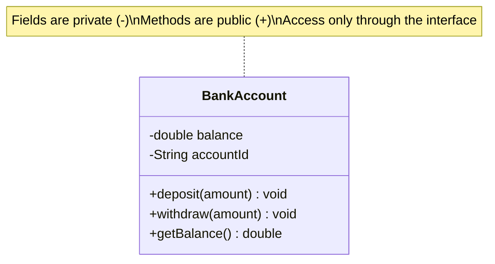

# Encapsulation

> **Encapsulation** is the bundling of data and the methods that operate on it into a single unit, combined with restricting direct access to that data so it can only be changed through a controlled interface.

## Why it matters

Interviewers ask about encapsulation because it's the foundation for everything else in OOP: you can't reason about inheritance, polymorphism, or clean APIs if internal state can be mutated from anywhere. It's also a favorite topic for probing whether a candidate understands *why* access modifiers exist, not just how to type `private`. A good answer connects encapsulation to invariants, maintainability, and the ability to change an implementation without breaking callers.

## Bundling Data and Behavior

A class groups related fields and the operations that make sense on them, instead of leaving data as loose structures that any function can poke at. The object becomes the single source of truth for how its own state can change.

```java
public class BankAccount {
    private double balance;   // hidden internal state

    public BankAccount(double openingBalance) {
        if (openingBalance < 0) {
            throw new IllegalArgumentException("Opening balance cannot be negative");
        }
        this.balance = openingBalance;
    }

    public void deposit(double amount) {
        if (amount <= 0) {
            throw new IllegalArgumentException("Deposit must be positive");
        }
        balance += amount;
    }

    public void withdraw(double amount) {
        if (amount <= 0 || amount > balance) {
            throw new IllegalArgumentException("Invalid withdrawal amount");
        }
        balance -= amount;
    }

    public double getBalance() {
        return balance;
    }
}
```

No external code can set `balance` to a negative number or skip validation, because the field is never exposed directly.

## Access Modifiers

Access modifiers are the mechanism that enforces encapsulation. The exact keywords and their reach vary by language, but the intent is consistent: expose the minimum surface needed and hide the rest.

| Modifier | Same class | Same package/module | Subclass (other package) | Everywhere |
|---|---|---|---|---|
| `private` | Yes | No | No | No |
| `protected` | Yes | Yes | Yes | No |
| package-private / internal (default) | Yes | Yes | No | No |
| `public` | Yes | Yes | Yes | Yes |

General guidance used across languages:
- Fields are almost always `private`; expose behavior, not state.
- `protected` is for members a subclass legitimately needs to extend or override.
- `public` is reserved for the intentional, stable API of the class.
- Prefer the narrowest modifier that satisfies the design — widen only when a real need appears.

## Getters and Setters

Getters and setters are the controlled doorway into private state. They matter because they let you attach validation, computed logic, or lazy behavior without changing the public contract.

```java
public void setEmail(String email) {
    if (email == null || !email.contains("@")) {
        throw new IllegalArgumentException("Invalid email format");
    }
    this.email = email;
}
```

A common interview trap is generating a getter/setter for every field by reflex. That defeats the purpose of encapsulation — it just re-exposes the field with extra syntax. Provide accessors only when external code genuinely needs to read or write that value, and consider exposing behavior instead (e.g., `account.deposit(amount)` rather than `account.setBalance(account.getBalance() + amount)`).

## Benefits: Invariants and Maintainability

- **Invariants**: An invariant is a condition that must always hold for an object (e.g., "balance is never negative"). Encapsulation lets the class enforce this at every mutation point, instead of trusting every caller to check it.
- **Maintainability**: Because the internal representation is hidden, it can be changed (a different data structure, a caching layer, a different storage format) without touching any calling code, as long as the public method signatures stay the same.
- **Reduced coupling**: Other code depends on behavior (methods), not on the shape of internal data, so classes can evolve independently.
- **Easier debugging**: When state can only change through a small set of methods, bugs that corrupt that state are traceable to a limited surface area instead of anywhere in the codebase.



## Encapsulation vs. Abstraction

These two are frequently confused in interviews. Encapsulation is about *hiding data and controlling access*; abstraction is about *hiding complexity and exposing only relevant behavior*. Encapsulation is a technique (access modifiers, packaging); abstraction is a design goal (simplified mental model). A class can be encapsulated without being a good abstraction, and vice versa, though in practice well-designed classes achieve both together.

## Common Interview Questions

**Q: What is encapsulation and why is it useful?**
A: It's bundling data with the methods that operate on it and restricting direct access to that data, typically via access modifiers. It's useful because it lets a class enforce its own invariants, hide implementation details, and change internally without breaking callers.

**Q: What's the difference between encapsulation and abstraction?**
A: Encapsulation hides *data* and controls access to it using visibility modifiers. Abstraction hides *complexity* by exposing only relevant behavior through a simplified interface. Encapsulation is a mechanism; abstraction is a design principle.

**Q: Why make fields private instead of public?**
A: Public fields can be mutated by any external code with no validation, no way to react to changes, and no way to later change the internal representation without breaking every caller. Private fields keep that control inside the class.

**Q: Are getters and setters always a good practice?**
A: No. Blindly adding a getter and setter for every field just re-exposes the internal state and defeats encapsulation. Accessors should exist only when external code has a real need, and often exposing a behavior method is better than exposing raw state.

**Q: What's the difference between `protected` and `private`?**
A: `private` restricts access to the declaring class only. `protected` additionally allows access from subclasses (and, in many languages, from code in the same package/module), which is useful when a subclass needs to extend or override inherited behavior.

**Q: Can encapsulation be broken through reflection or similar mechanisms?**
A: In many languages, yes — reflection APIs can bypass access modifiers at runtime. This doesn't invalidate encapsulation as a design principle; it's a deliberate escape hatch for tooling (serialization, testing frameworks) and should not be relied on in normal application logic.

**Q: How does encapsulation help with maintainability in a large codebase?**
A: Because callers depend only on public method signatures, the internal data structure, algorithms, or storage can be refactored freely as long as the public contract is preserved. This limits the blast radius of changes and makes large codebases safer to evolve.

## Related

- [Abstraction](abstraction.md) - hiding complexity vs. hiding data; often paired with encapsulation
- [Inheritance](inheritance.md) - how `protected` members interact with subclassing
- [Polymorphism](polymorphism.md) - relies on well-encapsulated, stable public interfaces
- [OOP Basics](basics.md) - where encapsulation fits among the four pillars
