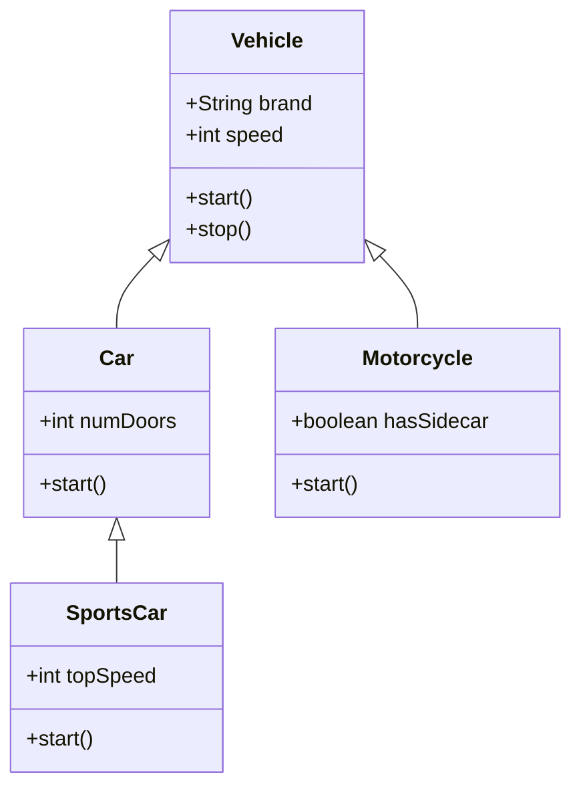
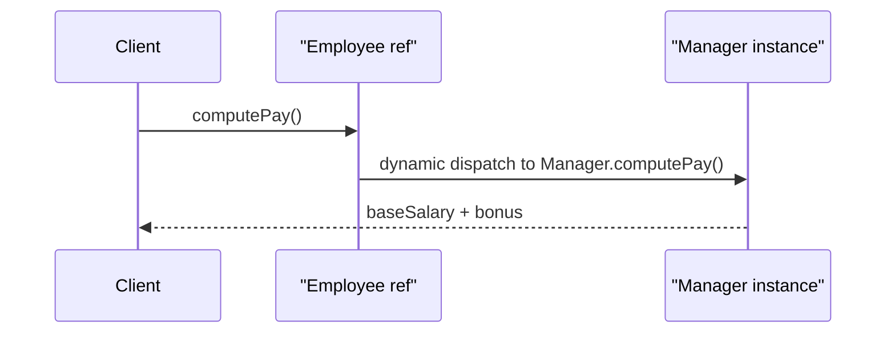
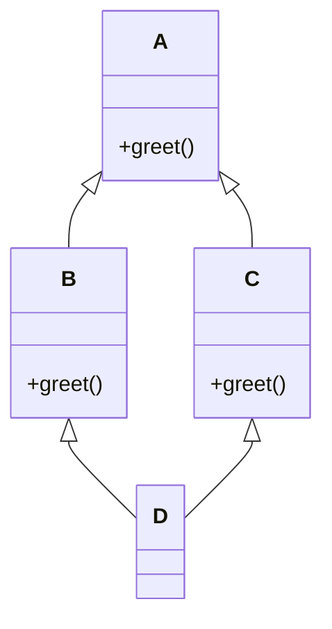

# Inheritance

> **Inheritance** is an object-oriented mechanism where a new class (subclass/derived class) acquires the fields and methods of an existing class (superclass/base class), modeling an **IS-A** relationship between them.

## Why it matters

Inheritance is one of the four pillars of OOP, and interviewers use it to check whether you understand code reuse trade-offs, not just syntax. It's easy to overuse inheritance and create brittle hierarchies, so a strong candidate can explain when *not* to use it, how method overriding and dynamic dispatch work under the hood, and how different languages resolve ambiguity like the diamond problem. This topic also often leads into SOLID principles (Liskov Substitution) and design pattern discussions.

## IS-A vs HAS-A

Inheritance models an **IS-A** relationship: a `Dog` IS-A `Animal`, a `Manager` IS-A `Employee`. If the relationship is better described as **HAS-A** (a `Car` HAS-A `Engine`), you should use composition instead of inheritance.

```java
// IS-A: Dog is a kind of Animal
class Animal {
    void eat() { System.out.println("eating"); }
}
class Dog extends Animal {
    void bark() { System.out.println("barking"); }
}
```

## Single, Multilevel, and Hierarchical Inheritance

- **Single inheritance**: one subclass extends exactly one superclass.
- **Multilevel inheritance**: a chain of classes, each extending the previous one (grandparent -> parent -> child).
- **Hierarchical inheritance**: multiple subclasses extend the same single superclass.
- **Multiple inheritance**: a subclass extends more than one superclass directly. Most mainstream class-based languages (Java, C#) disallow this for classes because it creates the diamond problem, though they allow it for interfaces/protocols.



The diagram above shows hierarchical inheritance (`Car` and `Motorcycle` both extend `Vehicle`) combined with multilevel inheritance (`SportsCar` extends `Car`, which extends `Vehicle`).

| Type | Description | Example |
|---|---|---|
| Single | One parent, one child | `Dog extends Animal` |
| Multilevel | Chain of classes | `Puppy extends Dog extends Animal` |
| Hierarchical | Many children, one parent | `Car`, `Motorcycle` both extend `Vehicle` |
| Multiple | One child, many parents | Disallowed for classes in Java/C#; allowed via interfaces |

## The `super` Keyword

`super` lets a subclass refer to its immediate superclass, used to:

1. Call the superclass constructor (must be the first statement in the subclass constructor in Java/C#).
2. Invoke an overridden method's original implementation.
3. Access a shadowed field.

```java
class Employee {
    protected double baseSalary;
    Employee(double baseSalary) { this.baseSalary = baseSalary; }
    double computePay() { return baseSalary; }
}

class Manager extends Employee {
    private double bonus;
    Manager(double baseSalary, double bonus) {
        super(baseSalary); // call parent constructor
        this.bonus = bonus;
    }
    @Override
    double computePay() {
        return super.computePay() + bonus; // reuse parent logic
    }
}
```

## Method Overriding

Overriding lets a subclass provide a specific implementation of a method already defined in its superclass, enabling **polymorphism** and **dynamic (runtime) dispatch** — the JVM/CLR picks the actual method to run based on the object's real type, not the reference type.



Key rules interviewers probe:
- Overriding requires the same method signature; overloading requires a different one.
- The overriding method's return type must be the same or a covariant subtype.
- Access modifiers can be widened but not narrowed (a `protected` method can become `public`, not `private`).
- Static, private, and final methods cannot be overridden (static methods are hidden, not overridden).

## Composition vs Inheritance

The classic "favor composition over inheritance" guidance exists because inheritance is the tightest form of coupling: subclasses depend on the internal behavior of their superclass, and changes to the base class can silently break every subclass (the **fragile base class problem**).

| Aspect | Inheritance | Composition |
|---|---|---|
| Relationship | IS-A | HAS-A |
| Coupling | Tight (implementation-dependent) | Loose (interface-dependent) |
| Flexibility | Fixed at compile time (single class-inheritance chain) | Can swap behavior at runtime |
| Reuse mechanism | Extend a base class | Delegate to a contained object |
| Risk | Fragile base class, deep/rigid hierarchies | Slightly more boilerplate (delegation) |

```java
// Composition: Car HAS-A Engine, delegates instead of extending
class Engine {
    void start() { System.out.println("engine starting"); }
}
class Car {
    private final Engine engine = new Engine();
    void start() { engine.start(); }
}
```

Prefer composition when you need runtime flexibility, want to avoid deep hierarchies, or the relationship is not a true IS-A. Prefer inheritance when there is a genuine, stable taxonomy and you want to leverage polymorphism through a common base type.

## The Diamond Problem

The diamond problem occurs when a class inherits from two classes that both derive from a common ancestor, and both provide (or override) the same method — the compiler can't tell which version the final subclass should use.



Here `D` inherits `greet()` via both `B` and `C`, so it's ambiguous which implementation `D` should get.

How languages resolve it:

- **C++**: Allows true multiple inheritance and lets the diamond occur. Resolved with `virtual` inheritance (so `A` is shared as a single instance) plus explicit scope resolution (`B::greet()` or `C::greet()`) when ambiguity remains.
- **Java / C#**: Disallow multiple inheritance of classes entirely, sidestepping the problem. They allow implementing multiple interfaces; if two default/interface methods conflict, the implementing class is forced to explicitly override and resolve the conflict (Java 8+ default methods require this).
- **Python**: Allows multiple inheritance and resolves ambiguity deterministically using the **C3 linearization algorithm** (Method Resolution Order / MRO), so there is always one well-defined order in which base classes are searched.
- **Ruby**: Avoids the diamond by not supporting multiple class inheritance, offering **mixins (modules)** instead, which are included into a class's single linear ancestor chain.

## Common Interview Questions

**Q: What is the difference between inheritance and composition, and when would you choose one over the other?**
A: Inheritance models IS-A and reuses code by extending a base class, tightly coupling subclass to superclass implementation. Composition models HAS-A and reuses code by holding a reference to another object and delegating to it, which is more flexible and testable. Choose composition by default; use inheritance only when there's a genuine, stable IS-A relationship and you need polymorphic substitution.

**Q: What is the diamond problem, and how does your language of choice handle it?**
A: It arises when a class inherits the same method from two parent classes that share a common ancestor, making the correct implementation ambiguous. Java and C# avoid it by disallowing multiple class inheritance; C++ allows it and resolves it with virtual inheritance and explicit scope resolution; Python resolves it deterministically via C3 linearization (MRO).

**Q: Can you override a private or static method?**
A: No. Private methods aren't visible to subclasses so they can't be overridden, only redefined independently. Static methods are resolved at compile time based on the reference type (method hiding), not at runtime based on the object type, so they aren't polymorphic.

**Q: What happens if you don't call `super()` explicitly in a subclass constructor?**
A: In languages like Java and C#, the compiler implicitly inserts a call to the superclass's no-argument constructor as the first statement. If the superclass has no no-arg constructor, this is a compile error and you must call `super(...)` explicitly with matching arguments.

**Q: Why is inheritance sometimes called "the fragile base class problem"?**
A: Because subclasses depend on the internal behavior of the base class, not just its public contract. A seemingly safe change to the base class (e.g., changing what one method calls internally) can silently break subclasses that override related methods, even though the public API didn't change.

**Q: How does inheritance relate to the Liskov Substitution Principle?**
A: LSP states that objects of a subclass should be replaceable wherever the superclass is expected without breaking correctness. Inheritance that violates behavioral expectations (e.g., a `Square extends Rectangle` that breaks independent width/height setters) is a classic sign that the hierarchy models IS-A incorrectly and should be redesigned, often with composition.

**Q: Give a real-world example of inheritance and explain the design choice.**
A: A payments system might have a `PaymentMethod` base class with `CreditCard`, `BankTransfer`, and `Wallet` subclasses, each overriding `process()`. This is appropriate because all subtypes genuinely IS-A `PaymentMethod`, share common fields like `amount` and `currency`, and callers need to treat them polymorphically through a single `process()` call.

## Related

- [Polymorphism](polymorphism.md) - method overriding is the mechanism that enables runtime polymorphism
- [Abstraction](abstraction.md) - abstract base classes often anchor an inheritance hierarchy
- [Encapsulation](encapsulation.md) - protected members and access modifiers govern what subclasses can see
