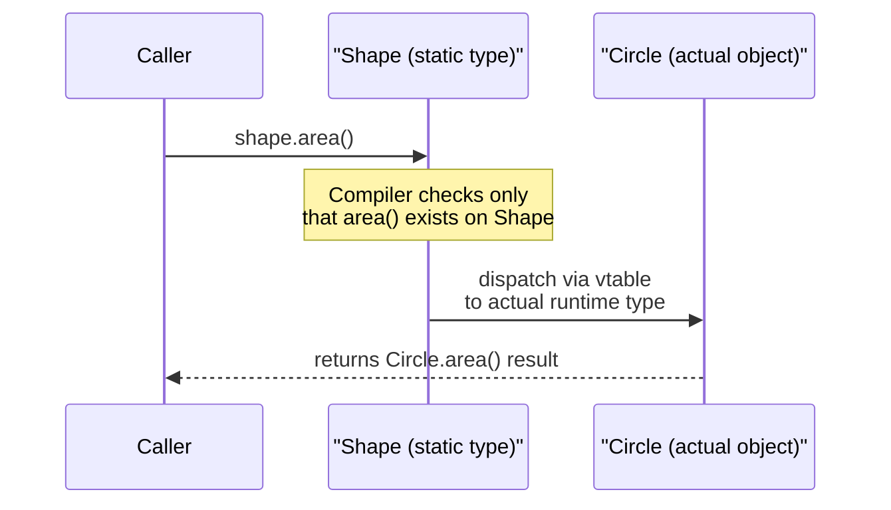
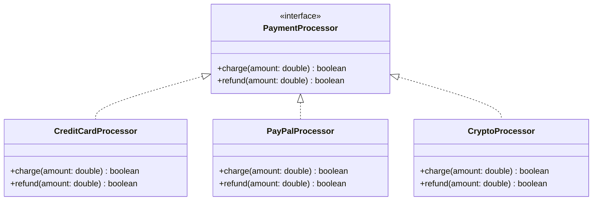

# Polymorphism

> **Polymorphism** is the ability of a single interface, method name, or reference type to represent different underlying implementations, so the correct behavior is selected either at compile time or at run time.

## Why it matters

Polymorphism is the mechanism that lets you write code against an abstraction (an interface or base class) and have it work correctly with any concrete implementation, including ones written after your code. Interviewers probe this topic to see whether you understand *how* dynamic dispatch actually works under the hood (vtables, method resolution), not just that "overriding is polymorphism." It also comes up because it is the foundation of extensible, testable, plugin-style architectures — the Open/Closed Principle depends on it directly.

## Compile-time vs runtime polymorphism

There are two distinct flavors, and interviewers often want you to name both and contrast them.

| Aspect | Compile-time (static) | Runtime (dynamic) |
|---|---|---|
| Mechanism | Method overloading, operator overloading | Method overriding |
| Resolved by | Compiler, based on argument types/count at the call site | JVM/runtime, based on the actual object's type |
| Also called | Static binding, early binding | Dynamic binding, late binding |
| Requires | Same method name, different signature | Inheritance/interface implementation + `virtual`/override |
| Typical example | `add(int, int)` vs `add(double, double)` | `Shape.area()` overridden by `Circle` and `Square` |

**Compile-time (overloading) example:**

```java
class Calculator {
    int add(int a, int b) { return a + b; }
    double add(double a, double b) { return a + b; }
    int add(int a, int b, int c) { return a + b + c; }
}
```

The compiler picks the matching `add` based on the argument types it sees at the call site. No inheritance is involved — this is really just convenient naming, resolved statically.

**Runtime (overriding) example:**

```java
abstract class Shape {
    abstract double area();
}

class Circle extends Shape {
    private final double radius;
    Circle(double radius) { this.radius = radius; }
    @Override double area() { return Math.PI * radius * radius; }
}

class Square extends Shape {
    private final double side;
    Square(double side) { this.side = side; }
    @Override double area() { return side * side; }
}

Shape s = getShapeFromSomewhere(); // returns Circle or Square
System.out.println(s.area()); // correct area() runs, decided at runtime
```

Here the compiler only knows `s` is a `Shape`. Which `area()` actually executes is decided when the program runs, based on the object's real class.

## Upcasting and dynamic dispatch

Upcasting is assigning a subclass instance to a variable of its supertype or interface type. It is always safe and often implicit, because a subclass "is-a" supertype.

```java
Circle circle = new Circle(2.0);
Shape shape = circle; // upcast: Circle -> Shape, implicit and safe
```

Once upcast, the variable's **static type** is `Shape`, but its **dynamic type** is still `Circle`. When you call `shape.area()`, the runtime does not look at the variable's declared type — it looks at the object's actual class and dispatches to `Circle.area()`. This lookup mechanism is called dynamic dispatch, and it is typically implemented via a virtual method table (vtable): each object carries a pointer to a table of method addresses for its actual class, and the call is resolved through that table rather than through the compile-time type.



The downcast direction (`Shape` back to `Circle`) is the opposite operation: it is not automatic, requires an explicit cast, and can fail at runtime (`ClassCastException` in Java) if the object isn't actually a `Circle`.

## Interface with multiple implementations

Polymorphism is most powerful when client code depends only on an interface, never on concrete classes. Any number of implementations can then be swapped in without touching the calling code.



```java
interface PaymentProcessor {
    boolean charge(double amount);
    boolean refund(double amount);
}

class CheckoutService {
    private final PaymentProcessor processor;
    CheckoutService(PaymentProcessor processor) { this.processor = processor; }

    boolean checkout(double amount) {
        return processor.charge(amount); // works for ANY implementation
    }
}
```

`CheckoutService` never references `CreditCardProcessor` or `PayPalProcessor` directly. It depends only on the `PaymentProcessor` contract, so a new `CryptoProcessor` can be added and injected without modifying `CheckoutService` at all.

## Why this matters for extensibility

This is the practical payoff interviewers are usually fishing for:

- **Open/Closed Principle** — code is open for extension (add a new subclass/implementation) but closed for modification (existing call sites don't change).
- **Plugin architectures and dependency injection** — frameworks wire up concrete implementations at runtime while business logic only ever talks to interfaces.
- **Testability** — a test double or mock can be substituted for a real implementation precisely because callers depend on the abstraction, not the concrete type.
- **Reduced coupling** — client code has one dependency (the interface) instead of one dependency per concrete class, which shrinks the blast radius of changes.

## Common Interview Questions

**Q: What's the difference between overloading and overriding?**
A: Overloading is compile-time polymorphism — multiple methods with the same name but different parameter lists in the same class, resolved by the compiler based on argument types. Overriding is runtime polymorphism — a subclass redefines a method with the identical signature inherited from a superclass or interface, resolved at runtime based on the object's actual type.

**Q: Can you overload a method by changing only its return type?**
A: No, in most statically typed languages (Java, C#) the return type alone is not part of the method signature used for overload resolution, so two methods differing only in return type will not compile.

**Q: How does dynamic dispatch actually work at the runtime level?**
A: Each object's class has a virtual method table (vtable) — an array of pointers to the actual method implementations for that class. A polymorphic call is resolved by looking up the method slot in the object's vtable at runtime, not by using the static/declared type of the reference.

**Q: Is upcasting ever unsafe or does it need an explicit cast?**
A: Upcasting (subtype to supertype) is always safe and is usually done implicitly, since every subclass instance genuinely satisfies the supertype's contract. Downcasting (supertype back to subtype) is the risky direction — it requires an explicit cast and can throw a runtime exception if the object isn't actually of that subtype.

**Q: Why prefer coding against an interface instead of a concrete class?**
A: It decouples calling code from any specific implementation, letting you swap, extend, or mock implementations without changing the caller. This is what makes polymorphism the backbone of the Open/Closed Principle and of testable, pluggable designs.

**Q: Does polymorphism apply to fields/variables, or only methods?**
A: In most mainstream OOP languages, only methods are dynamically dispatched; fields are resolved statically based on the declared (static) type of the reference, even if the actual object is a subclass that shadows the field. This is a common gotcha: accessing a field through a supertype reference gets the supertype's field, not the subclass's.

**Q: What is ad-hoc polymorphism vs parametric polymorphism?**
A: Ad-hoc polymorphism is what method overloading and operator overloading provide — different behavior per concrete type, defined explicitly for each case. Parametric polymorphism is what generics/templates provide — a single implementation that works uniformly across any type parameter without knowing the concrete type in advance.

## Related

- [Inheritance](inheritance.md) - polymorphism's overriding form depends on the is-a relationship inheritance establishes
- [Abstraction](abstraction.md) - interfaces and abstract classes define the contract that polymorphic implementations fulfill
- [Encapsulation](encapsulation.md) - hiding implementation details is what makes swapping polymorphic implementations safe
- [OOP Basics](basics.md) - foundational terms referenced throughout this page
