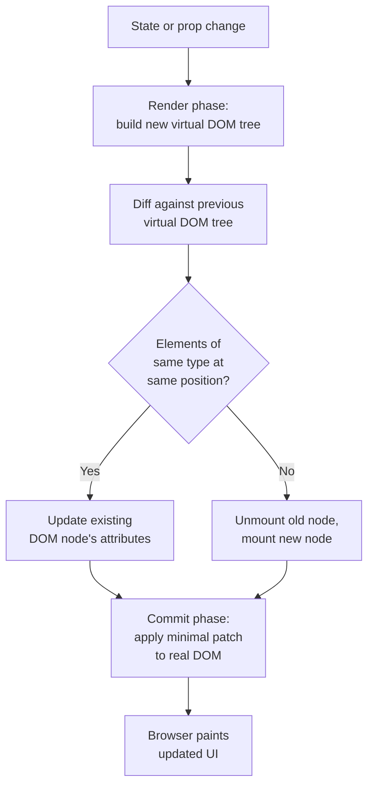
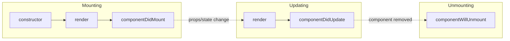

# React

> **React** is a JavaScript library for building user interfaces out of small, reusable **components** that describe what the UI should look like for a given state.

## Why it matters
React questions test whether a candidate understands more than JSX syntax: how rendering actually works, why keys and immutability matter, and when to reach for state vs. props vs. context. Interviewers use it as a proxy for general front-end reasoning - performance trade-offs, data flow, and lifecycle timing - because most teams build on React or a component model like it.

## Components: Function vs Class

A component is a JavaScript function (or class) that returns JSX describing part of the UI. Modern React code is almost entirely function components plus hooks; class components are legacy but still show up in older codebases and interview questions.

```jsx
// Function component (modern)
function Greeting({ name }) {
  return <h1>Hello, {name}!</h1>;
}

// Class component (legacy)
class Greeting extends React.Component {
  render() {
    return <h1>Hello, {this.props.name}!</h1>;
  }
}
```

| Aspect | Function Component | Class Component |
|---|---|---|
| State | `useState` / `useReducer` hooks | `this.state` + `this.setState` |
| Side effects | `useEffect` | Lifecycle methods (`componentDidMount`, etc.) |
| `this` binding | Not needed | Required for methods, common bug source |
| Code reuse | Custom hooks | Higher-order components / render props |
| Error boundaries | Not possible (no hook equivalent) | `componentDidCatch` / `getDerivedStateFromError` |
| Current recommendation | Preferred | Legacy, mainly for error boundaries |

## Props vs State

Props and state are the two sources of data that drive what a component renders, but they differ in ownership and mutability.

| | Props | State |
|---|---|---|
| Owned by | Parent component | The component itself |
| Mutability | Read-only (immutable) inside the receiving component | Mutable via `setState` / the hook's setter |
| Direction of flow | Passed down, top to bottom | Local, can be lifted up if shared |
| Triggers re-render? | Yes, when the value changes | Yes, when updated |

React's data flow is unidirectional: state lives in some component, and is passed down as props to children. When a child needs to affect data owned by an ancestor, the ancestor passes a callback down as a prop ("lifting state up").

## Hooks

Hooks let function components use state and other React features without writing a class. A few rules apply to all hooks: call them only at the top level of a component (never inside loops/conditions), and only from React functions.

**useState** - local, synchronous-looking state for a single render:

```jsx
const [count, setCount] = useState(0);
```

**useEffect** - runs side effects (data fetching, subscriptions, manual DOM work) after render, and can clean up before the next run or on unmount:

```jsx
useEffect(() => {
  const id = setInterval(() => setCount(c => c + 1), 1000);
  return () => clearInterval(id); // cleanup
}, []); // dependency array: [] = run once on mount
```

The dependency array controls when the effect re-runs: omitted means every render, `[]` means once on mount, `[dep]` means whenever `dep` changes.

**useContext** - reads a value from the nearest `Context.Provider` above, avoiding prop drilling through many layers:

```jsx
const ThemeContext = React.createContext('light');

function Toolbar() {
  const theme = useContext(ThemeContext);
  return <div className={theme}>...</div>;
}
```

## The Virtual DOM and Reconciliation

The virtual DOM is a lightweight, in-memory tree of plain JavaScript objects that mirrors the real DOM. On every state or prop change, React builds a new virtual DOM tree, diffs it against the previous tree (the "diffing algorithm"), and computes the minimal set of real DOM mutations needed - this whole process is called **reconciliation**. Because real DOM writes are expensive and JS object comparisons are cheap, this batching of updates is what makes React fast.



React's diffing uses two heuristics to stay fast (O(n) instead of the theoretical O(n^3) for generic tree diffs): elements of different types produce entirely different trees, and list items are matched using the `key` prop rather than by position.

## Keys

`key` is a special prop React uses to identify which items in a list have been added, removed, or reordered between renders. Without stable keys, React falls back to comparing by index, which can cause state to attach to the wrong element or force unnecessary DOM rebuilds when a list is reordered.

```jsx
{items.map(item => (
  <ListItem key={item.id} data={item} />
))}
```

Rules of thumb: keys must be unique among siblings (not globally), and should come from stable data like a database ID - never from array index if the list can be reordered, filtered, or have items inserted.

## Lifecycle

Class components expose explicit lifecycle methods; function components achieve the same timing through `useEffect` and its dependency array.



| Phase | Class method | Function component equivalent |
|---|---|---|
| Mount | `componentDidMount` | `useEffect(fn, [])` |
| Update | `componentDidUpdate` | `useEffect(fn, [deps])` |
| Unmount | `componentWillUnmount` | cleanup function returned from `useEffect` |
| Catch errors | `componentDidCatch`, `getDerivedStateFromError` | No hook equivalent - still requires a class-based error boundary |

## Common Interview Questions

**Q: What is the difference between the virtual DOM and the real DOM?**
A: The real DOM is the browser's actual rendered document; manipulating it directly is slow because it triggers layout and paint. The virtual DOM is an in-memory JS representation React diffs against the previous version, so it can compute and apply only the minimal set of real DOM changes.

**Q: Why do function components need hooks instead of just local variables?**
A: A plain local variable resets every render and doesn't trigger a re-render when it changes. `useState` persists a value across renders (React stores it outside the function) and schedules a re-render when its setter is called.

**Q: What happens if you don't pass a dependency array to `useEffect`?**
A: The effect runs after every render. An empty array `[]` runs it once after the initial mount; a populated array runs it only when one of those values changes between renders.

**Q: Why is using array index as a key considered an anti-pattern?**
A: If the list order can change (insert, remove, reorder, filter), the index no longer maps to the same logical item across renders. React may then reuse a DOM node and its internal state for what is conceptually a different item, causing stale UI or wrong component state.

**Q: Can hooks be called conditionally?**
A: No. Hooks must be called in the same order on every render because React tracks them by call order internally, not by name. Calling them inside `if` statements or loops breaks that ordering and causes subtle state bugs.

**Q: How do props differ from state in terms of who can change them?**
A: Props are owned and controlled by the parent and are read-only from the child's perspective; a child should never mutate its own props. State is owned by the component itself and changed only via its own setter (`setState` or a hook's updater function).

**Q: What triggers a re-render in React?**
A: A state update in the component (or an ancestor re-rendering, which by default re-renders all children unless memoized with `React.memo`), a prop change from the parent, or a context value change for components consuming that context.

## Related
- [React Interview Guide](interview-guide.md) - deeper dive with more code examples, Redux, routing, and performance topics
