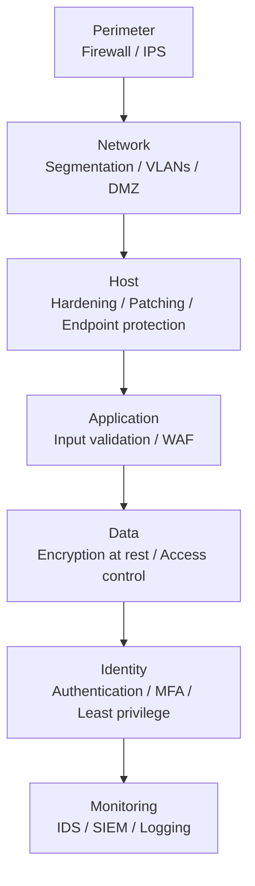

# Network & Application Security

> **Network and application security** is the set of controls - encryption, access control, filtering, and monitoring - used to protect data and systems as they move across networks and are used by applications.

## Why it matters

Interviewers probe this topic to check whether you think in layers rather than relying on a single control. Real breaches almost always exploit a gap between two layers (e.g., a firewall that's fine but an application that trusts unsanitized input). Expect questions that mix textbook definitions (IDS vs IPS) with scenario-based ones ("how would you secure a public-facing app?").

## Authentication vs Authorization

These are frequently confused but solve different problems and usually happen in sequence.

| Aspect | Authentication | Authorization |
|---|---|---|
| Question answered | Who are you? | What are you allowed to do? |
| Order | Happens first | Happens after authentication succeeds |
| Typical mechanisms | Passwords, MFA, biometrics, client certificates, tokens (JWT/OIDC) | RBAC, ABAC, ACLs, OAuth scopes |
| Failure mode | Impersonation / identity theft | Privilege escalation |

A common real-world flow: a client authenticates once (e.g., via OIDC) to get a token, then that token's claims are checked on every subsequent request to authorize specific actions.

## Defense in Depth

No single control is trusted to stop every attack. Instead, overlapping layers each add friction, so a failure in one layer doesn't mean full compromise.



If an attacker bypasses the firewall, network segmentation limits lateral movement; if they reach a host, patching and endpoint protection slow them down; if they reach the application, input validation and a WAF block common payloads; and if data is stolen anyway, encryption at rest renders it useless without the key.

## Encryption: In Transit vs At Rest

| | In Transit | At Rest |
|---|---|---|
| Protects | Data moving across a network | Data stored on disk, in a database, or in backups |
| Common technology | TLS/SSL, IPsec, VPN tunnels | AES-256 disk/volume encryption, database transparent data encryption (TDE) |
| Key attack it prevents | Eavesdropping, man-in-the-middle | Theft of stolen disks, backups, or database dumps |

TLS uses asymmetric cryptography (e.g., RSA or ECDHE) during the handshake to agree on a session key, then switches to fast symmetric encryption (e.g., AES) for the actual data - a hybrid cryptosystem. This is also why "symmetric vs asymmetric" comes up as a standalone question: symmetric is fast and used for bulk data, asymmetric is slower but solves key exchange and authentication.

## Firewalls and Network Segmentation

- **Firewalls** filter traffic against rules on IP, port, and protocol. Stateless firewalls inspect each packet independently; stateful firewalls track connection state, allowing context-aware decisions (e.g., only allow return traffic for connections the internal network initiated).
- **DMZ (Demilitarized Zone)**: a network segment that isolates public-facing services (web servers, reverse proxies) from the internal network, so a compromised public server doesn't give direct access to internal systems.
- **VLANs and segmentation**: splitting a flat network into isolated zones limits broadcast domains and restricts lateral movement if a host is compromised.
- **Zero Trust**: assumes no implicit trust even for internal traffic. Every request is authenticated and authorized, combined with micro-segmentation and least privilege, instead of trusting anything "inside the perimeter."

## Common Attacks and Mitigations

| Attack | Mechanism | Key mitigations |
|---|---|---|
| XSS (Cross-Site Scripting) | Malicious script is injected into a page and executed in another user's browser | Output encoding/escaping, Content-Security-Policy, input validation, `HttpOnly`/`Secure` cookies |
| CSRF (Cross-Site Request Forgery) | A logged-in user's browser is tricked into sending an unwanted authenticated request | Anti-CSRF tokens, `SameSite=Strict/Lax` cookies, re-authentication for sensitive actions |
| SQL Injection | Unsanitized input alters the structure of a SQL query | Parameterized queries/prepared statements, ORM query builders, least-privilege DB accounts |
| MITM (Man-in-the-Middle) | Attacker intercepts or alters traffic between two parties, often via ARP poisoning or rogue Wi-Fi | TLS everywhere, HSTS, certificate validation/pinning, mutual TLS |

```sql
-- Vulnerable: user input concatenated directly into the query
SELECT * FROM users WHERE username = '" + input + "';

-- Safe: parameterized query, input is never interpreted as SQL
SELECT * FROM users WHERE username = ?;
```

Other network-layer attacks worth knowing: **SYN flood** (exhausts server resources with incomplete TCP handshakes; mitigated with SYN cookies and rate limiting), **ARP poisoning** (fake ARP replies redirect traffic; mitigated with dynamic ARP inspection and static entries), **IP spoofing** (forged source IP to impersonate a trusted host), and **DNS attacks** (cache poisoning, DNS tunneling for data exfiltration, DNS amplification for DDoS - mitigated with DNSSEC and monitoring recursive resolvers).

## Monitoring and Detection

- **IDS (Intrusion Detection System)**: passively monitors traffic and alerts on suspicious activity.
- **IPS (Intrusion Prevention System)**: sits inline and actively blocks detected threats in real time.
- **SIEM**: aggregates logs across firewalls, hosts, and applications to correlate events and surface indicators of compromise (unusual outbound traffic, repeated failed logins, traffic spikes).
- **WAF (Web Application Firewall)**: inline filtering specifically for HTTP traffic, catching layer-7 attacks like XSS and SQLi payloads that a network firewall wouldn't understand.

## Common Interview Questions

**Q: What is the difference between authentication and authorization?**
A: Authentication verifies identity ("who are you"), authorization determines permissions ("what can you do"). Authentication always happens first; authorization decisions are then made using that established identity.

**Q: How does TLS protect data in transit?**
A: It uses asymmetric encryption during the handshake to authenticate the server (via certificates) and agree on a shared session key, then uses fast symmetric encryption for the actual data, providing confidentiality, integrity, and authentication.

**Q: What is the difference between IDS and IPS?**
A: An IDS passively monitors traffic and generates alerts on suspicious activity. An IPS sits inline and actively blocks or drops malicious traffic in real time. IDS is detective, IPS is preventive.

**Q: Explain SQL injection and how to prevent it.**
A: SQL injection occurs when unsanitized user input is concatenated into a SQL query, letting an attacker alter its logic (e.g., bypass a login check or dump a table). Prevent it with parameterized queries/prepared statements, ORM frameworks, and least-privilege database accounts.

**Q: What is CSRF and how do SameSite cookies help?**
A: CSRF tricks an authenticated user's browser into submitting a request the user didn't intend, exploiting the browser's automatic inclusion of cookies. `SameSite=Strict` or `Lax` cookies prevent the browser from sending the session cookie on cross-site requests, breaking the attack; anti-CSRF tokens provide a second layer of defense.

**Q: What is a man-in-the-middle attack, and how does ARP poisoning enable one on a local network?**
A: A MITM attack intercepts or alters communication between two parties who believe they're talking directly to each other. On a LAN, ARP poisoning lets an attacker send forged ARP replies that associate their MAC address with the gateway's IP, routing victim traffic through the attacker. TLS and dynamic ARP inspection are the primary defenses.

**Q: Why is defense in depth important instead of relying on a strong firewall?**
A: A firewall only protects the network perimeter; it does nothing if an attacker gets in through a phished credential, a vulnerable application, or an insider. Defense in depth layers independent controls (network, host, application, data, identity, monitoring) so that a failure in one layer is caught by another, rather than resulting in full compromise.

## Related

- [Penetration Testing](penetration-testing.md) - the offensive practice of actively probing these same controls (firewalls, auth, injection points) to validate they hold up
