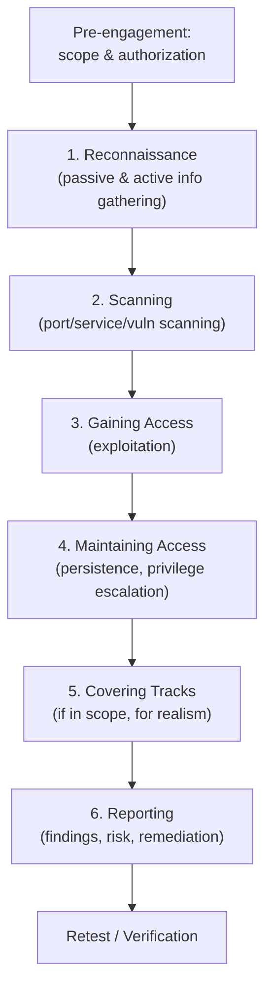

# Penetration Testing

> **Penetration testing** (pen testing) is an authorized, simulated attack against a system, network, or application to identify exploitable security weaknesses before real attackers do.

## Why it matters
Interviewers ask about pen testing to check whether a candidate understands offensive security as a *structured, accountable* process rather than "hacking for fun." It signals whether you grasp the legal and ethical boundaries around security testing, can reason about attacker methodology (which sharpens your defensive thinking), and know how findings translate into business risk. For security-adjacent roles, this topic also probes whether you can distinguish testing types and communicate risk to non-technical stakeholders.

## Authorization, Scope, and Ethics (the most important part)
A penetration test is only legitimate, and only legal, when it is explicitly authorized. Without written authorization, the exact same actions constitute unauthorized computer access, which is a crime in most jurisdictions regardless of intent.

Key elements of a properly run engagement:

- **Rules of Engagement (RoE)**: a signed document defining what can be tested, what techniques are allowed (e.g., is social engineering or denial-of-service testing in scope?), testing windows, and emergency stop conditions.
- **Get-out-of-jail-free letter / authorization letter**: written proof of permission from the system owner, carried by the tester in case testing is detected and escalated (e.g., to law enforcement).
- **Scope definition**: precise list of in-scope IP ranges, domains, applications, and physical locations, and an explicit list of what is out of scope (e.g., third-party SaaS, production databases, other customers' shared infrastructure).
- **Confidentiality**: any data accessed during testing (credentials, PII, customer records) must be handled as strictly confidential, minimized, and disposed of per the contract, never retained or shared beyond the report.
- **Non-destructive by default**: testers avoid actions with irreversible impact (data deletion, service outages) unless explicitly authorized, and stop immediately if a test is causing unintended harm.
- **Responsible disclosure**: findings go to the system owner first, through agreed channels, not to the public or to unrelated third parties.

Testing a system you do not own or lack explicit authorization for, even "just to check," is illegal and unethical. This is the single most important distinction between a penetration tester and an attacker.

## Black Box, White Box, and Grey Box Testing

| Type | Tester's prior knowledge | Simulates | Trade-offs |
|---|---|---|---|
| Black box | None (no source code, architecture, or credentials) | An external attacker with no insider knowledge | Most realistic external view; slower, may miss internal logic flaws |
| White box | Full access (source code, architecture diagrams, credentials) | An insider or a thorough audit | Deepest coverage, fastest to find logic/code-level flaws; less realistic as an "attack" |
| Grey box | Partial (e.g., a standard user account, limited docs) | A malicious insider or a compromised low-privilege account | Balances realism and efficiency; the most common choice for web app engagements |

## Phases of a Penetration Test

Most methodologies (PTES, OWASP Testing Guide, NIST SP 800-115) converge on the same core phases.

- **Reconnaissance**: Gathering information about the target, either **passively** (OSINT: public records, DNS, job postings, social media, no direct interaction with the target) or **actively** (direct interaction like probing services, which the target may detect).
- **Scanning**: Identifying live hosts, open ports, running services, and known vulnerabilities using automated tooling; this turns broad recon into a concrete attack surface map.
- **Gaining Access (exploitation)**: Attempting to exploit identified vulnerabilities to achieve unauthorized access, using techniques such as exploiting unpatched software, weak credentials, misconfigurations, or injection flaws.
- **Maintaining Access**: Simulating what a real attacker would do after initial compromise, escalating privileges and establishing persistence, to demonstrate the real-world impact of the initial foothold (e.g., can they reach a domain controller or customer database?).
- **Reporting**: Documenting findings with severity ratings, reproduction steps, evidence, business impact, and concrete remediation guidance. This is the deliverable that actually drives risk reduction, arguably the most important phase.

Many engagements also include a **cleanup/covering tracks** step (removing test artifacts, reverting changes) and a **retest** after remediation to confirm fixes actually worked.

## Common Tool Categories
Rather than memorizing specific product names, understand the categories and what each does:

- **Reconnaissance / OSINT tools**: gather public information (DNS records, subdomains, metadata, employee/social data).
- **Network and port scanners**: discover live hosts, open ports, and running services.
- **Vulnerability scanners**: match discovered services/versions against known CVE databases.
- **Web application proxies/scanners**: intercept and manipulate HTTP traffic to test for injection, auth, and logic flaws.
- **Exploitation frameworks**: package and automate known exploits against identified vulnerabilities.
- **Password/credential attack tools**: test for weak, reused, or default credentials.
- **Post-exploitation and C2 (command-and-control) frameworks**: simulate persistence, lateral movement, and privilege escalation after initial access.

## Related
- [Network Security](network-security.md) - the defensive controls (firewalls, segmentation, IDS/IPS) that pen tests are designed to validate

## Common Interview Questions

**Q: What is the difference between a vulnerability assessment and a penetration test?**
A: A vulnerability assessment identifies and catalogs potential weaknesses, typically via automated scanning, without attempting to exploit them. A penetration test goes further by actively attempting exploitation to prove impact and confirm the vulnerability is real and exploitable, not a false positive.

**Q: Why is written authorization so critical before starting a pen test?**
A: Without explicit, written authorization defining scope, the same technical actions are indistinguishable from unauthorized computer intrusion, a criminal offense in most jurisdictions. Authorization also protects the tester legally, defines boundaries so testing doesn't disrupt production, and ensures the client's stakeholders (including any third parties whose infrastructure might be touched) have consented.

**Q: What's the difference between black box, white box, and grey box testing?**
A: Black box testing gives the tester no prior knowledge, simulating an external attacker. White box gives full access to source code and architecture, simulating a thorough internal audit. Grey box gives partial knowledge, such as a standard user account, simulating an insider threat or a compromised low-privilege account; it's the most common approach for balancing realism with efficiency.

**Q: Walk me through the phases of a penetration test.**
A: Reconnaissance gathers information about the target; scanning maps the live attack surface (hosts, ports, services, known vulnerabilities); gaining access exploits a vulnerability to achieve unauthorized entry; maintaining access simulates privilege escalation and persistence to show real-world impact; and reporting documents findings with severity, evidence, and remediation steps for the client.

**Q: What should a good pen test report include?**
A: Each finding should have a clear description, severity/risk rating, reproduction steps or proof-of-concept evidence, the affected business impact, and specific, actionable remediation guidance. A good report also includes an executive summary for non-technical stakeholders and, ideally, a retest confirming fixes worked.

**Q: How does penetration testing differ from red teaming?**
A: Penetration testing is typically scoped to a specific system or application over a fixed period, aiming to find as many vulnerabilities as possible. Red teaming is broader and goal-oriented (e.g., "reach the crown-jewel database undetected"), testing an organization's detection and response capabilities as much as its technical vulnerabilities, often without the blue team's knowledge.

**Q: If you discover a critical vulnerability that could take down production, what do you do?**
A: Stop and follow the rules of engagement: most RoEs require immediately notifying the client's designated contact before proceeding, rather than continuing to exploit it. Testers avoid destructive actions unless explicitly pre-authorized, and any high-impact finding should be escalated out-of-band rather than waiting for the final report.
