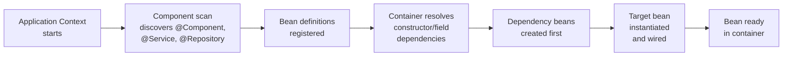
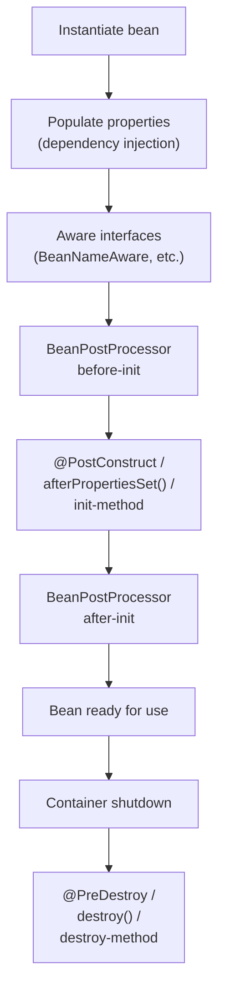
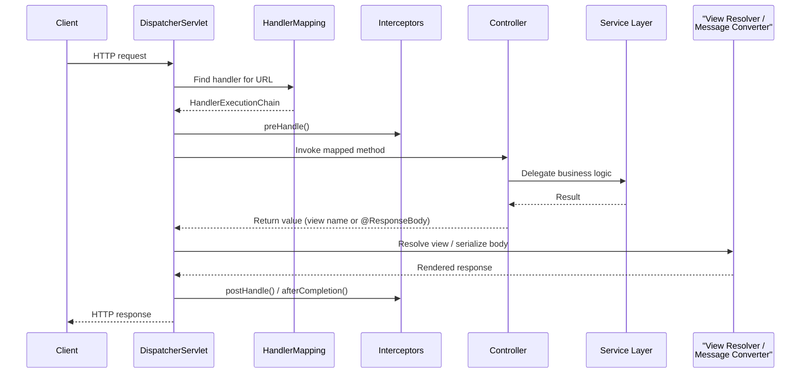

# Spring Framework

> **Inversion of Control (IoC)** is the core principle behind Spring: instead of your objects creating and wiring their own dependencies, a container creates them and injects what's needed.

## Why it matters

Spring questions show up in almost every Java backend interview because the framework encodes a set of design principles (IoC, DI, separation of concerns, convention over configuration) that interviewers use as a proxy for how well you understand object composition and application architecture. Beyond reciting annotations, interviewers want to see that you understand *why* the container exists, what a bean's lifecycle looks like, and how a request actually travels through a Spring Boot application. Weak answers name-drop annotations; strong answers explain the mechanics underneath them.

## IoC and Dependency Injection

Inversion of Control means the framework, not your code, controls object creation and wiring. Dependency Injection (DI) is the specific technique Spring uses to implement IoC: the container builds objects (beans), resolves their dependencies, and injects them, typically via constructor, setter, or field injection.

| Injection type | How it works | Notes |
|---|---|---|
| Constructor injection | Dependencies passed via constructor args | Preferred - enables immutability, makes required dependencies explicit, plays well with final fields and testing |
| Setter injection | Dependencies set via setter methods | Useful for optional dependencies |
| Field injection | `@Autowired` directly on a field | Convenient but harder to unit test and hides required dependencies; generally discouraged in production code |

```java
@Service
public class OrderService {

    private final PaymentClient paymentClient;

    // Constructor injection - no @Autowired needed on a single constructor
    public OrderService(PaymentClient paymentClient) {
        this.paymentClient = paymentClient;
    }
}
```



## Beans and Scopes

A **bean** is any object whose lifecycle (creation, wiring, destruction) is managed by the Spring IoC container. Beans are defined via `@Component`-family annotations or explicit `@Bean` methods, and each bean has a scope that controls how many instances exist and when they are created.

| Scope | Lifetime | Typical use |
|---|---|---|
| `singleton` (default) | One instance per container | Stateless services, repositories |
| `prototype` | New instance on every lookup/injection | Stateful, non-thread-safe helpers |
| `request` | One instance per HTTP request | Web-tier data scoped to a request (needs web-aware context) |
| `session` | One instance per HTTP session | User-session-scoped state |
| `application` | One instance per `ServletContext` | Shared web-app-wide state |

Injecting a `prototype` bean into a `singleton` naively only creates the prototype once, at wiring time - a common gotcha. The fix is a scoped proxy (`proxyMode`) or an `ObjectProvider`/`ObjectFactory` lookup so a fresh instance is fetched on each use.

## The Bean Lifecycle

Understanding lifecycle callbacks is a frequent whiteboard question, since it explains exactly when your code can hook into initialization and cleanup.



`BeanPostProcessor` implementations are the extension point Spring itself uses internally (e.g. to process `@Autowired` and `@Transactional`), which is why they run both before and after initialization for every bean in the context.

## Key Annotations

| Annotation | Purpose |
|---|---|
| `@Component` | Marks a class as a Spring-managed bean, discovered via component scanning |
| `@Service`, `@Repository`, `@Controller` | Specializations of `@Component` that add semantic meaning (and, for `@Repository`, automatic exception translation) |
| `@Autowired` | Requests the container to inject a matching bean by type (falling back to name on ambiguity, or combined with `@Qualifier`) |
| `@Configuration` | Marks a class as a source of bean definitions, itself a `@Component` |
| `@Bean` | Used inside a `@Configuration` class to declare a bean explicitly, typically for third-party classes you can't annotate directly |
| `@Qualifier` | Disambiguates between multiple candidate beans of the same type |
| `@Value` | Injects a property or SpEL expression value into a field |

```java
@Configuration
public class AppConfig {

    @Bean
    public RestTemplate restTemplate(RestTemplateBuilder builder) {
        return builder.build();
    }
}
```

`@Component` is for classes you own and can annotate; `@Bean` is for objects you construct yourself (third-party libraries, objects needing custom construction logic) - a distinction interviewers like to probe.

## Spring Boot Auto-Configuration

Spring Boot's `@EnableAutoConfiguration` (bundled inside `@SpringBootApplication`) inspects the classpath and existing bean definitions, then conditionally registers beans that make sense for the detected setup. It relies on `@Conditional`-family annotations such as `@ConditionalOnClass`, `@ConditionalOnMissingBean`, and `@ConditionalOnProperty`. For example, if `spring-boot-starter-data-jpa` and an embedded database driver are on the classpath, Boot auto-configures a `DataSource`, an `EntityManagerFactory`, and a `PlatformTransactionManager` - unless you've already defined your own beans of those types, in which case your definitions win. This "convention over configuration with escape hatches" approach is what lets a Boot app start with almost no XML or manual wiring while still being fully overridable.

## Spring MVC Request Flow



The `DispatcherServlet` is the front controller for every Spring MVC request. It consults `HandlerMapping` to find the right controller method, runs any registered `HandlerInterceptor`s, invokes the controller, and then either resolves a logical view name to a template (traditional MVC) or, for `@RestController`/`@ResponseBody` methods, delegates to an `HttpMessageConverter` (e.g. Jackson) to serialize the return value directly to the response body.

## Common Interview Questions

**Q: What's the difference between `@Component` and `@Bean`?**
A: `@Component` is a class-level annotation picked up by component scanning for classes you own. `@Bean` is a method-level annotation inside a `@Configuration` class used to manually construct and register a bean, most often for third-party classes you can't annotate or when the construction logic needs custom parameters.

**Q: Why is constructor injection generally preferred over field injection?**
A: Constructor injection makes dependencies explicit and immutable (fields can be `final`), fails fast at startup if a required dependency is missing, and is trivial to unit test without a Spring context, since you can just call `new` with mocks. Field injection hides the dependency graph and requires reflection-based tools like Mockito's `@InjectMocks` or a running context to test.

**Q: What happens if Spring finds two beans of the same type during autowiring?**
A: It throws a `NoUniqueBeanDefinitionException` unless the ambiguity is resolved, typically with `@Qualifier` to pick a bean by name, `@Primary` to mark a default candidate, or by matching the injection point's field/parameter name to a bean name.

**Q: What is the default bean scope, and when would you use `prototype`?**
A: `singleton` is the default - one shared instance per container. `prototype` creates a new instance on every injection or lookup, useful for stateful, non-thread-safe objects; note that injecting a prototype into a singleton naively only instantiates it once, so a scoped proxy or `ObjectProvider` is needed to get a fresh instance per use.

**Q: How does Spring Boot decide which auto-configurations to apply?**
A: It evaluates `@Conditional` annotations (`@ConditionalOnClass`, `@ConditionalOnMissingBean`, `@ConditionalOnProperty`, etc.) against the classpath, environment properties, and beans already defined in the context, only activating a configuration when its conditions are satisfied - and backing off if you've already defined an equivalent bean yourself.

**Q: What's the role of the `DispatcherServlet` in Spring MVC?**
A: It's the front controller that receives every incoming HTTP request, delegates to `HandlerMapping` to find the matching controller, runs interceptors, invokes the controller method, and then resolves the result to a rendered view or a serialized response body.

**Q: What is `BeanPostProcessor` used for?**
A: It's an extension point that lets code run logic before and after every bean's initialization callbacks across the whole container. Spring uses it internally to implement features like `@Autowired` processing, AOP proxy creation, and `@Async`/`@Transactional` support.

## Related

- [Design Patterns](../design-patterns/basics.md) - Spring's IoC container is a large-scale application of the Factory and Singleton patterns
- [Java OOP](../java/java-oop.md) - DI and bean wiring build directly on interfaces, polymorphism, and composition
- [Microservices](../microservices/microservices.md) - Spring Boot is the most common foundation for building microservices in Java
