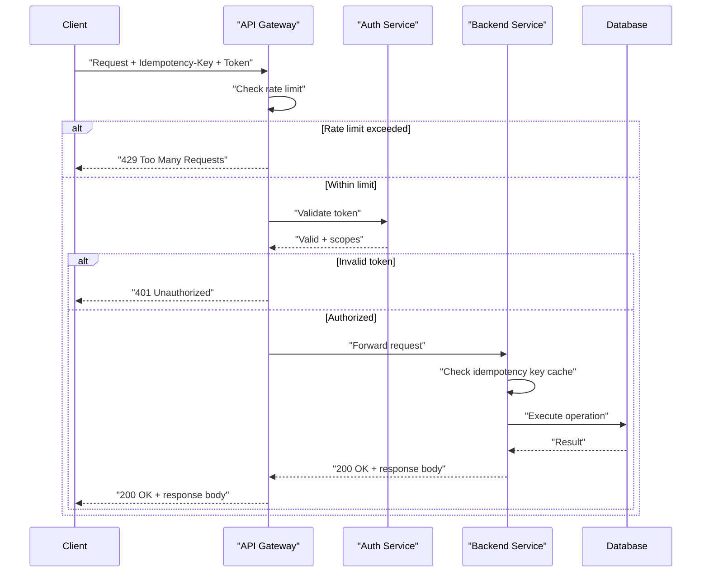

# API Design

> **API design** is the practice of defining how clients and services communicate - resource shape, protocol semantics, versioning, and failure behavior - so that the contract stays stable, predictable, and safe to evolve.

## Why it matters

API design questions test whether a candidate thinks about a system from the outside in: can another team integrate against this without reading the source code? Interviewers use it to probe judgment on trade-offs (REST vs GraphQL, URL vs header versioning), and to see if you account for the messy realities of distributed systems - retries, partial failures, and clients you don't control. A well-designed API is also a forcing function for good backend design, since it exposes coupling and inconsistency early.

## Core Principles

- **Clarity**: predictable and self-documenting - a developer should be able to guess the next endpoint.
- **Consistency**: naming, casing, and error shapes identical across every endpoint.
- **Backward compatibility**: additive changes shouldn't break existing clients; breaking changes need a version bump.
- **Statelessness**: each request carries everything needed to process it - no server-side session affinity.
- **Least surprise**: HTTP verbs and status codes mean what the spec says they mean.

## RESTful Resource Naming

Model nouns (resources), not verbs (actions). Use plural nouns, nest sub-resources under their parent, and let the HTTP method express the action.

```
Good:
GET  /api/v1/users/123
GET  /api/v1/users/123/posts
GET  /api/v1/users/123/posts/456

Bad:
GET /api/getUser?id=123
GET /api/getUserPosts?userId=123
```

## Versioning Strategies

| Strategy | Example | Trade-off |
|---|---|---|
| URL path | `/api/v2/users` | Most visible and cache-friendly; clutters the URL and encourages full-resource duplication |
| Query parameter | `/api/users?version=2` | Easy to default, but often skipped by clients and less cacheable |
| Custom header | `X-API-Version: 2` | Keeps URLs clean; less discoverable, harder to test in a browser |
| Content negotiation | `Accept: application/vnd.example.v2+json` | Most "correct" per HTTP semantics; more complex for clients to implement |

Most public APIs use URL-path versioning for discoverability, bump only the major version on breaking changes, and support the previous version for a defined deprecation window.

## Pagination

Offset-based pagination (`page`/`limit` or `offset`/`limit`) is simple but degrades on large tables and shifts under concurrent writes. Cursor-based pagination (an opaque token pointing to the last seen item) is stable under inserts/deletes and scales better because it avoids `OFFSET` scans in the database.

```
Offset-based:
GET /api/users?page=2&limit=20

Cursor-based:
GET /api/users?cursor=eyJpZCI6NDB9&limit=20

Response:
{
  "data": [...],
  "pagination": {
    "next_cursor": "eyJpZCI6NjB9",
    "has_more": true
  }
}
```

## Filtering, Sorting, and Field Selection

```
GET /api/posts?status=published&category=tech
GET /api/posts?sort=-created_at,title
GET /api/users/123?fields=name,email
```

Sparse fieldsets (`fields=`) reduce payload size for bandwidth-constrained clients. Keep filter/sort syntax consistent across every collection endpoint.

## Error Handling

Return a consistent error envelope: machine-readable code, human-readable message, and a request ID for support/debugging - never just a bare status code.

```json
{
  "error": {
    "code": "USER_NOT_FOUND",
    "message": "User 123 does not exist",
    "details": { "user_id": "123" },
    "request_id": "abc-123-def"
  }
}
```

| Code | Meaning | Use case |
|---|---|---|
| 200 | OK | Successful GET, PUT, PATCH |
| 201 | Created | Successful POST |
| 204 | No Content | Successful DELETE |
| 400 | Bad Request | Malformed input, validation failure |
| 401 | Unauthorized | Missing or invalid credentials |
| 403 | Forbidden | Authenticated but not permitted |
| 404 | Not Found | Resource doesn't exist |
| 409 | Conflict | Duplicate resource, version/state mismatch |
| 422 | Unprocessable Entity | Semantically invalid input |
| 429 | Too Many Requests | Rate limit exceeded |
| 500 | Internal Server Error | Unhandled server fault |
| 503 | Service Unavailable | Overloaded or in maintenance |

## Idempotency

An operation is **idempotent** if repeating it has the same effect as doing it once. `GET`, `PUT`, and `DELETE` are idempotent by HTTP definition; `POST` is not. This matters because clients retry on timeouts, and a timeout doesn't tell you whether the server actually processed the request.

The fix is a client-generated **idempotency key** sent as a header on `POST` (e.g. `Idempotency-Key: 8f3a...`). The server stores the key with the result of the first execution and returns that cached result on any retry, instead of re-running the side effect - critical for payments and order creation.

```
POST /api/payments
Idempotency-Key: 8f3a1c2e-...

First call: charges the card, stores result under the key, returns 201.
Retry with same key: returns the same 201 response, no second charge.
```

## Rate Limiting

| Algorithm | How it works | Trade-off |
|---|---|---|
| Token bucket | Tokens refill at a fixed rate; each request consumes one | Allows controlled bursts; simple to reason about |
| Sliding window | Counts requests in a rolling time window | Smooths bursts better than fixed window; more state to track |
| Leaky bucket | Requests processed at a constant rate, excess queued or dropped | Produces very even output rate; adds latency under load |

Communicate limits to clients via standard headers so they can back off cooperatively:

```
X-RateLimit-Limit: 1000
X-RateLimit-Remaining: 999
X-RateLimit-Reset: 1372700873
```

## Authentication and Authorization

Authentication answers "who are you"; authorization answers "what are you allowed to do." Keep them as separate concerns even when one token carries both.

| Method | Best for |
|---|---|
| API keys | Simple server-to-server or internal integrations |
| OAuth 2.0 | User-facing apps needing delegated, scoped access |
| JWT | Stateless auth across microservices, verifiable without a shared session store |
| mTLS | Service-to-service traffic inside a trusted network/mesh |

Authorization is then enforced with RBAC (roles map to permissions), ABAC (decisions based on resource/user attributes), or OAuth scopes limiting what a token can do.

## Request Flow Through a Gateway

A typical production request passes through several concerns before it reaches business logic - each one a potential place to reject or short-circuit the request.



## Caching

HTTP caching offloads read traffic from the origin. `Cache-Control` governs freshness (`max-age`, `public`/`private`, `no-store`); `ETag`/`If-None-Match` supports validation so a client gets a cheap `304 Not Modified` instead of re-downloading unchanged data.

```
Cache-Control: public, max-age=3600
ETag: "33a64df551425fcc55e4d42a148795d9f25f89d4"
If-None-Match: "33a64df551425fcc55e4d42a148795d9f25f89d4"
```

## Webhooks

Webhooks push events to clients instead of making them poll. Sign payloads with HMAC so the receiver can verify authenticity, include a timestamp to reject replays, and retry failed deliveries with exponential backoff.

```
POST https://client.example.com/callback
X-Signature: hmac-sha256=...
{
  "event": "user.created",
  "data": { "id": 123, "name": "John" },
  "timestamp": "2024-01-20T10:00:00Z"
}
```

## REST vs GraphQL

| | REST | GraphQL |
|---|---|---|
| Endpoints | Many, one per resource | Single endpoint |
| Fetching | Over/under-fetching common | Client specifies exact fields needed |
| Caching | Native HTTP caching (per URL) | Harder - typically app-level caching |
| Typing | Optional (OpenAPI on top) | Schema is mandatory and strongly typed |
| Best fit | Public APIs, simple CRUD, cache-heavy reads | Complex/nested data, mobile clients, many client shapes |

## Deprecating a Version

Announce the deprecation and target removal date well in advance, support the old version for a defined window (commonly 6-12 months), publish a migration guide, and monitor usage so you know when removal is safe.

## Common Interview Questions

**Q: What's the difference between PUT and PATCH?**
A: `PUT` replaces the entire resource and is idempotent. `PATCH` applies a partial update and is only idempotent if you design it that way (e.g. setting an absolute value rather than incrementing).

**Q: How do you make a POST request idempotent?**
A: Require an idempotency key (a client-generated unique token) in a header. The server persists the key with the result of the first execution and returns that cached result on any retry with the same key, instead of re-running the side effect.

**Q: Why prefer cursor-based pagination over offset-based for large datasets?**
A: Offset pagination scans and discards `offset` rows, getting slower as the offset grows, and results can shift if rows are inserted or deleted between pages. Cursor pagination anchors to a stable position (e.g. the last seen ID), so it stays fast and consistent under concurrent writes.

**Q: How would you version a large public API without breaking existing clients?**
A: Version at the URL path for breaking changes, keep additive changes (new optional fields, new endpoints) unversioned, and run the previous major version alongside the new one for a published deprecation window before removal.

**Q: How do you prevent abuse of a public API?**
A: Combine authentication (attributable requests), rate limiting (token bucket or sliding window per key/IP), input validation, and monitoring/alerting on anomalous traffic.

**Q: What should a good API error response include?**
A: A correct HTTP status code, a stable machine-readable error code, a human-readable message, optional field-level details, and a request ID for tracing.

**Q: When would you choose GraphQL over REST?**
A: When clients have highly varied data needs (e.g. mobile vs web) and REST would force over- or under-fetching. The trade-off is losing simple HTTP-level caching and taking on server-side query cost management.

## Related

- [Scalability](scalability.md) - rate limiting, caching, and pagination choices here are directly shaped by scalability trade-offs
