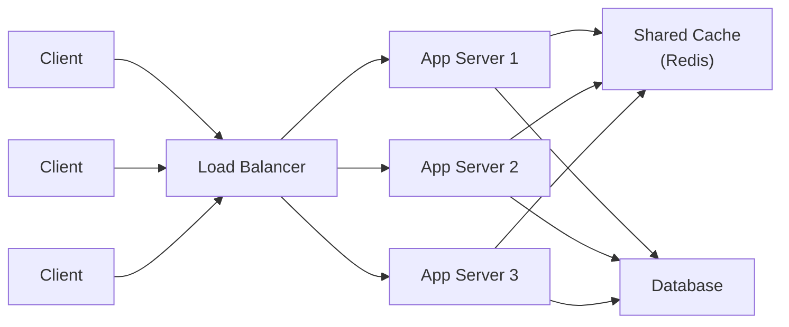
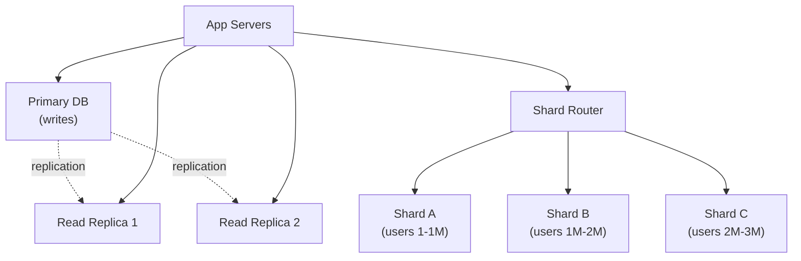

# Scalability

> **Scalability** is a system's ability to handle growing amounts of work - more users, more data, more requests - by adding resources, without a corresponding degradation in performance.

## Why it matters

Scalability questions let an interviewer see how you reason about trade-offs under growth: when to add hardware versus add machines, how to keep servers replaceable, and how to keep data available as load increases. Almost every system design interview (URL shorteners, chat apps, feed systems) eventually asks "what happens at 10x traffic?" - and the answer is built from the primitives in this document: horizontal scaling, statelessness, caching, CDNs, and data-layer partitioning.

## Vertical vs. Horizontal Scaling

| | Vertical (Scale Up) | Horizontal (Scale Out) |
|---|---|---|
| How | Add CPU/RAM/disk to one machine | Add more machines |
| Limit | Hits physical hardware ceiling | Effectively unlimited |
| Complexity | Low - single node, no distribution | Higher - needs load balancing, coordination |
| Fault tolerance | Single point of failure | Failure of one node doesn't take down the system |
| Cost curve | High-end hardware gets expensive fast | Commodity hardware, pay incrementally |
| Data consistency | Trivial (one copy of data) | Harder (replication, partitioning) |

In practice, most systems do both: scale a node up to a reasonable size, then scale out horizontally once that stops being cost-effective or fault-tolerant enough.

## Stateless Services

Horizontal scaling only works cleanly if any server can handle any request. That requires services to be **stateless**: no request-specific data (session state, in-memory user data) lives only on one server's local memory or disk.

- Store session state in a shared store (Redis, a database) instead of server memory.
- Use sticky sessions only as a stopgap - they reintroduce a soft dependency on a specific node and complicate failover.
- Stateless services can be freely added, removed, or replaced by an orchestrator (Kubernetes, an auto-scaling group) without losing user data.
- Statelessness is also what makes health checks and rolling deployments safe - a server can be killed and traffic simply flows to the others.

## Load Balancing

A load balancer sits in front of a fleet of servers and distributes incoming traffic so no single instance is overwhelmed.

**Common algorithms:**

1. **Round Robin** - requests cycle evenly across servers.
2. **Least Connections** - routes to the server with the fewest active connections.
3. **Weighted Round Robin** - favors servers with more capacity.
4. **IP Hash** - routes based on client IP, giving basic session affinity.
5. **Least Response Time** - routes to the currently fastest server.

**Layer 4 vs Layer 7:**

- **Layer 4 (Transport)**: routes on IP/TCP/UDP info only - fast, but content-blind.
- **Layer 7 (Application)**: routes on HTTP data (headers, path, cookies) - enables smarter routing (e.g., path-based routing to microservices) at some extra latency cost.

## Caching

Caching reduces load on slower backing stores by serving repeated reads from fast, closer storage.

| Level | Where | Example |
|---|---|---|
| Client-side | Browser cache, local storage | HTTP cache headers |
| CDN | Edge locations near the user | CloudFront, Cloudflare, Fastly |
| Application | In-memory, shared across app servers | Redis, Memcached |
| Database | Query result cache | Query cache, materialized views |

**Invalidation strategies:** TTL (automatic expiry), event-based invalidation on writes, write-through (write to cache and DB together), write-behind (write to cache, flush to DB asynchronously).

**Eviction policies:** LRU (evict least recently used), LFU (evict least frequently used), FIFO, and random eviction.

A well-known failure mode is **cache stampede**: many requests miss the cache simultaneously (e.g., on expiry of a hot key) and all hit the database at once. Mitigations include request coalescing/locking, staggered TTLs (jitter), and serving stale data while a single request refreshes the cache in the background.

## CDN (Content Delivery Network)

A CDN caches static (and sometimes dynamic) content at edge servers geographically close to users, cutting latency and offloading origin servers.

- Best suited to content that doesn't change per-request: images, CSS/JS bundles, videos, static HTML.
- Reduces load on origin infrastructure since repeat requests from a region are served from the edge, not the origin.
- Modern CDNs also do TLS termination, DDoS mitigation, and can cache API responses briefly with short TTLs.
- Cache invalidation across edge nodes (purging) is the main operational complexity to plan for.

## Database Scaling: Replication and Sharding

**Read replicas** - copies of the primary database that serve read-only queries, letting reads scale independently of writes. The trade-off is **replication lag**: replicas are eventually consistent with the primary, so a client that writes and immediately reads from a replica may not see its own write.

**Sharding** - horizontal partitioning of data across multiple database instances, each holding a subset of rows (by key range, hash, or geography). Sharding scales both reads and writes but introduces real complexity:

- Cross-shard joins and transactions become expensive or impossible without extra coordination.
- Resharding (adding/removing shards) requires careful data migration.
- Choosing a good shard key is critical to avoid hot shards.

**Caching database queries** with a cache-aside pattern (check cache, on miss read DB and populate cache) reduces load on both replicas and shards for hot read paths.

## Message Queues and Async Processing

Queues (RabbitMQ, Kafka, AWS SQS) decouple producers from consumers so traffic spikes are buffered rather than propagated directly into synchronous work. This lets slow or bursty work (email sending, image processing, analytics) happen asynchronously without blocking the request path or requiring the backend to be provisioned for peak load at all times.

## Auto-scaling

Auto-scaling adds or removes compute automatically based on metrics like CPU, memory, request rate, or queue depth. Because stateless services can be started/stopped freely, auto-scaling groups can scale out under load and scale in when idle. Cold-start time (how long a new instance takes to become ready) is a key constraint - if it's slow, scaling reacts too late to help with sudden spikes.

## Common Interview Questions

**Q: When would you choose vertical scaling over horizontal scaling?**
A: When the system is simple, doesn't yet need high availability, and the workload doesn't parallelize well (e.g., a single large in-memory computation or a legacy monolith with tight coupling). Vertical scaling is also a reasonable first step before investing in distributed-system complexity.

**Q: Why is statelessness important for horizontal scaling?**
A: It lets a load balancer send any request to any server, so servers can be added, removed, or restarted without losing user data. Session or request state needs to live in a shared store instead of server memory.

**Q: What's the difference between a read replica and a shard?**
A: A read replica holds a full copy of the data and only serves reads, scaling read throughput. A shard holds a subset of the data and can serve both reads and writes, scaling both throughput and storage - at the cost of losing easy cross-shard queries and transactions.

**Q: What happens when your cache goes down or a hot key expires under load?**
A: You risk a cache stampede where many requests miss simultaneously and hit the database at once. Mitigate with locking/request coalescing so only one request repopulates the cache, TTL jitter to avoid synchronized expiry, and graceful fallback to stale data if the database is overwhelmed.

**Q: How does a CDN help scalability, and what can't it help with?**
A: It serves cacheable static content from edge locations close to users, cutting latency and offloading the origin. It doesn't help with highly dynamic, per-user, or write-heavy traffic, which still needs to reach the origin.

**Q: How would you scale a system to handle 10x its current traffic?**
A: Identify the bottleneck first (CPU-bound app tier, DB reads, DB writes, or network). Typically: add stateless app servers behind a load balancer, introduce or expand caching, add read replicas for read-heavy load, and shard the database if writes are the bottleneck. Add a CDN for static assets and queues to absorb bursty background work.

**Q: What's a shard key, and why does choosing one matter?**
A: The shard key determines how data is partitioned across shards. A poor choice (e.g., a key with a very uneven distribution) creates hot shards that get disproportionate load, defeating the purpose of sharding. A good shard key spreads both data and query load evenly.

## Related

- [API Design](api-design.md) - designing the interfaces that scaled services expose to clients
