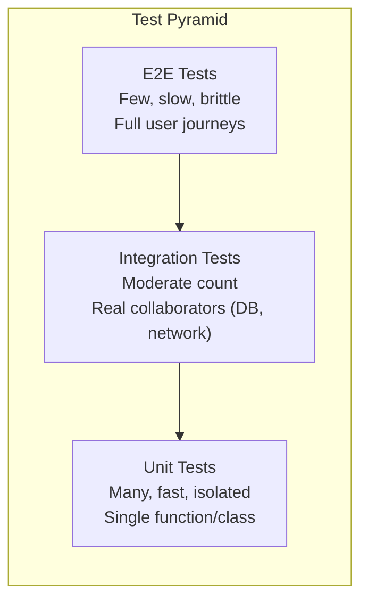
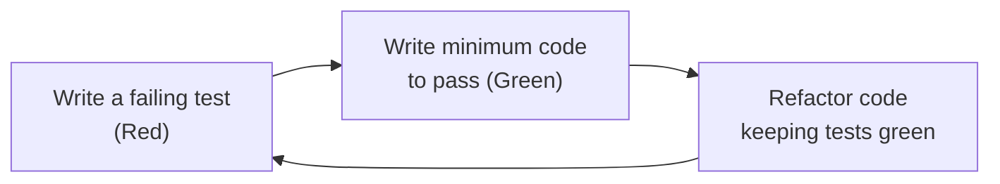
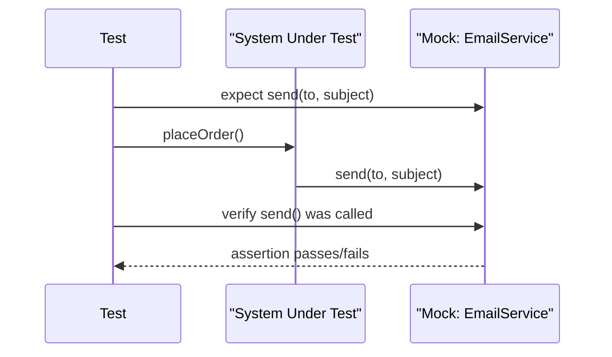

# Software Testing Fundamentals

> **Software testing** is the process of verifying that a system behaves as expected, organized around a mix of automated test levels, disciplined development cycles, and deliberate coverage strategies.

## Why it matters

Interviewers ask about testing fundamentals because writing code that works today is easy; writing code a team can trust and change safely for years is not. Questions about the test pyramid, TDD, and mocks vs stubs reveal whether a candidate designs for testability and understands the cost/speed tradeoffs of different test types, rather than treating coverage as a target instead of a signal.

## The Test Pyramid

The test pyramid is a heuristic for how many tests to write at each level of granularity. Lower layers are cheaper, faster, and more numerous; higher layers are slower, more expensive, and fewer in number but closer to real user behavior.

| Layer | Scope | Speed | Cost to maintain | Typical count |
|---|---|---|---|---|
| Unit | A single function/class in isolation | Milliseconds | Low | Many (hundreds-thousands) |
| Integration | Multiple components/modules together (e.g. service + DB) | Seconds | Medium | Moderate |
| End-to-end (E2E) | Full system through the UI or public API | Seconds-minutes | High | Few |

An inverted pyramid ("ice cream cone"), with a large E2E suite and few unit tests, is a common anti-pattern: it produces slow, flaky CI pipelines and hard-to-localize failures. Push verification as far down the pyramid as correctness allows, and reserve E2E tests for critical paths (login, checkout, core workflows).

## TDD: Red-Green-Refactor

Test-Driven Development is a workflow where the test is written before the implementation, in a tight loop:

1. **Red** - write a failing test that expresses the next small piece of desired behavior. It fails because the code doesn't exist yet.
2. **Green** - write the minimum code needed to make the test pass, without over-engineering.
3. **Refactor** - clean up the implementation (and the test, if needed) while keeping all tests green, improving structure without changing behavior.

The value of TDD isn't just "tests exist" - it's that the suite is built incrementally alongside the design, which tends to produce smaller, more decoupled units because untestable code is painful to test first. It can slow initial development and doesn't suit exploratory/spike work, so many teams apply it selectively for core business logic rather than universally.

## Mocks vs Stubs vs Fakes

These are all **test doubles** - objects that stand in for real dependencies - but they differ in intent and verification.

| Type | Purpose | Verification | Example |
|---|---|---|---|
| **Dummy** | Fills a parameter, never used | None | A `null`/placeholder object |
| **Stub** | Returns pre-programmed answers | State-based | Stubbed `charge()` always returns `success` |
| **Mock** | Verifies interactions (calls, args, order) | Behavior-based | Assert `send()` was called once with a given address |
| **Fake** | A working, simplified implementation | State-based | An in-memory DB replacing a real one |

The distinction that matters most in interviews: **stubs and fakes support state verification** ("did the system end up in the right state?"), while **mocks support behavior verification** ("were the right calls made?"). Overusing mocks couples tests tightly to implementation details, so prefer stubs/fakes for most cases and reserve mocks for side effects with no observable state (like "was this event published").

## Code Coverage

Code coverage measures the percentage of code executed by the test suite. Common metrics:

- **Line coverage** - percentage of executable lines run at least once.
- **Branch coverage** - percentage of decision branches (`if`/`else`, `switch`) exercised in both directions.
- **Path coverage** - percentage of distinct execution paths; the most rigorous and hardest to fully achieve.

Coverage is a **necessary but not sufficient** signal: 100% line coverage can still miss bugs if assertions are weak or absent (a test that calls a function but never checks its output "covers" the line without verifying correctness). It's best for finding untested code, not for proving correctness. Most teams set a practical threshold on critical modules rather than chasing 100% everywhere, since the last few percent (getters/setters, defensive code) is often expensive and low-value.

## Black-Box vs White-Box Testing

| Aspect | Black-box | White-box |
|---|---|---|
| Knowledge of internals | None - tests via inputs/outputs | Full - tests code structure |
| Typically written by | QA/testers, from requirements | Developers, from implementation |
| Techniques | Equivalence partitioning, boundary value analysis | Statement/branch/path coverage |
| Finds | Functional defects, missing requirements | Logic errors, dead/unreachable code |

**Gray-box testing** sits between the two: the tester has partial knowledge of internals (e.g., a database schema or API contract) to design more targeted black-box-style tests. In practice, unit tests are usually white-box, while acceptance/E2E tests are usually black-box.

## Common Interview Questions

**Q: Why is the test pyramid shaped like a pyramid and not a rectangle?**
A: Unit tests are cheap and fast, so you can afford many; integration and E2E tests involve more moving parts (networks, databases, browsers), making them slower, flakier, and costlier, so you want fewer, reserved for what unit tests can't verify - real collaboration between components.

**Q: What's the practical difference between a mock and a stub?**
A: A stub returns canned data and the test asserts on the resulting state; a mock is verified directly - the test asserts specific methods were called with specific arguments. Using a mock where a stub would do over-specifies the test and makes it brittle to refactoring.

**Q: Does 100% code coverage mean the code is bug-free?**
A: No. Coverage only tells you a line or branch executed, not that it was checked with a meaningful assertion, and it says nothing about untested input combinations, integration issues, or missing requirements.

**Q: What is the TDD cycle and what's the point of writing the test first?**
A: Red-green-refactor: write a failing test, write the minimum code to pass it, then refactor while tests stay green. Writing the test first forces you to think about the API and desired behavior before implementation, so every line of production code exists to satisfy a test rather than being retrofitted afterward.

**Q: When would you choose a fake over a mock?**
A: When you need something that behaves like the real dependency across multiple calls and states, such as an in-memory repository standing in for a database. Fakes let you write natural, state-based assertions and reuse the same double across many tests, whereas mocks suit a single interaction you want to verify precisely.

**Q: Give an example of black-box vs white-box test design for the same function.**
A: For a function classifying ages into categories, black-box testing picks representative and boundary inputs (e.g., -1, 0, 17, 18, 120) based on the spec alone. White-box testing looks at the actual `if/else` branches and writes a test per branch so every condition and its negation is exercised, including branches the spec didn't explicitly call out.

**Q: How do you decide how much to test at the integration level versus mocking everything in unit tests?**
A: Mock true external boundaries (third-party APIs, payment providers, unrelated services) in unit tests to keep them fast and isolated, but use integration tests for seams that carry real risk, like actual database queries or how your code talks to a message broker, since mocking those away can hide bugs that only surface with the real implementation.

## Related

- [CI/CD Pipelines](../devops/cicd.md) - how automated tests gate builds and deployments
- [REST API Design](../api/concepts.md) - the contracts that integration and E2E tests exercise
- [Agile Interview Questions](../agile/questions.md) - how testing practices fit into iterative delivery
